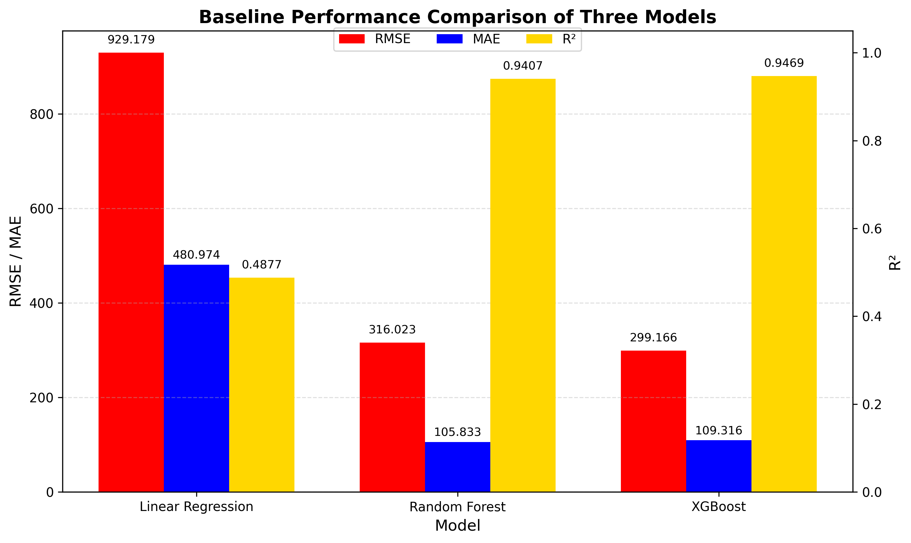
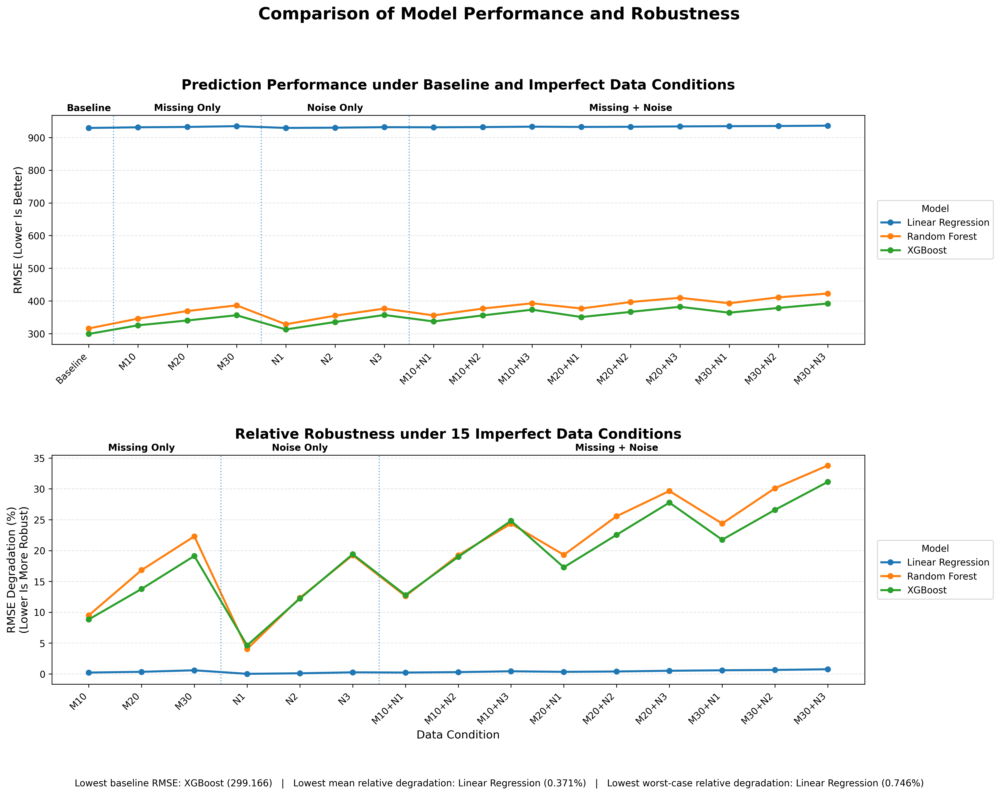
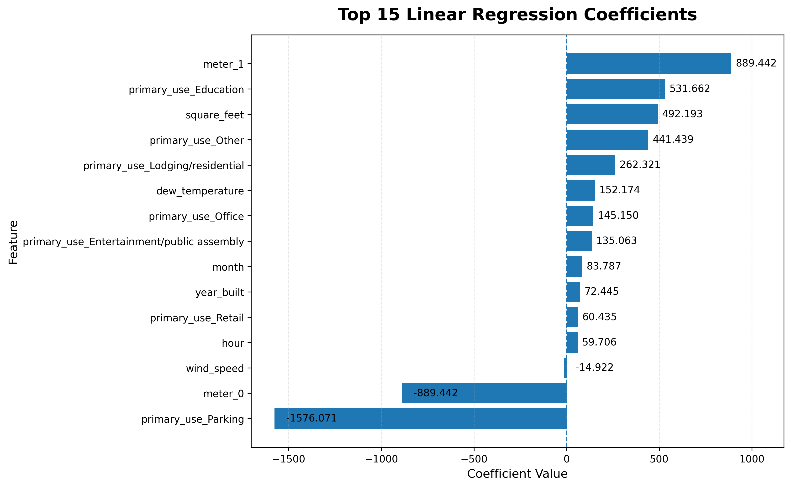
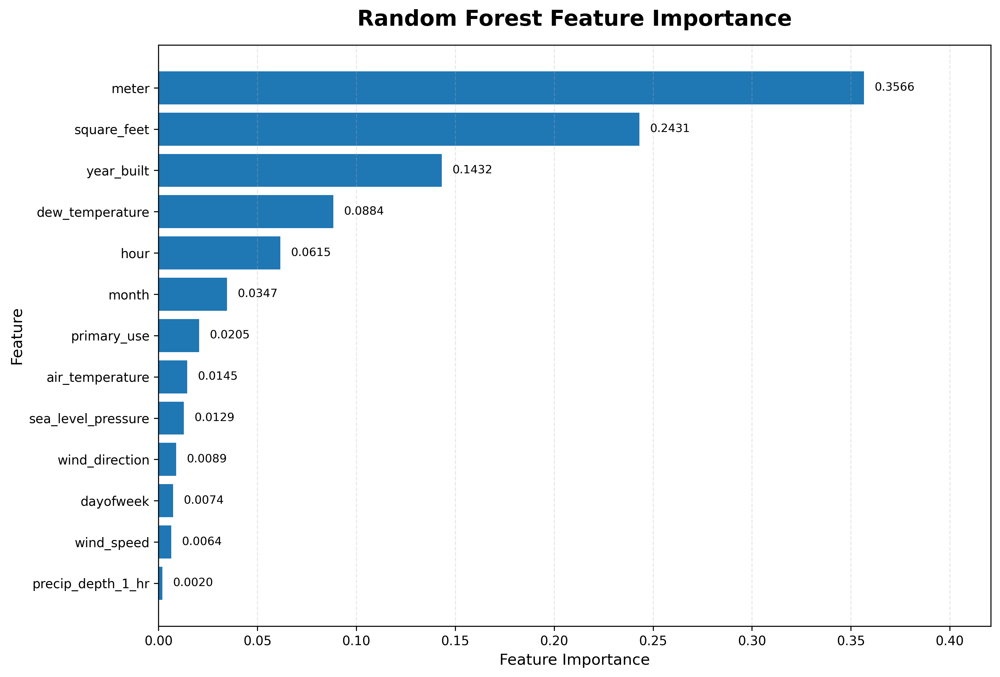
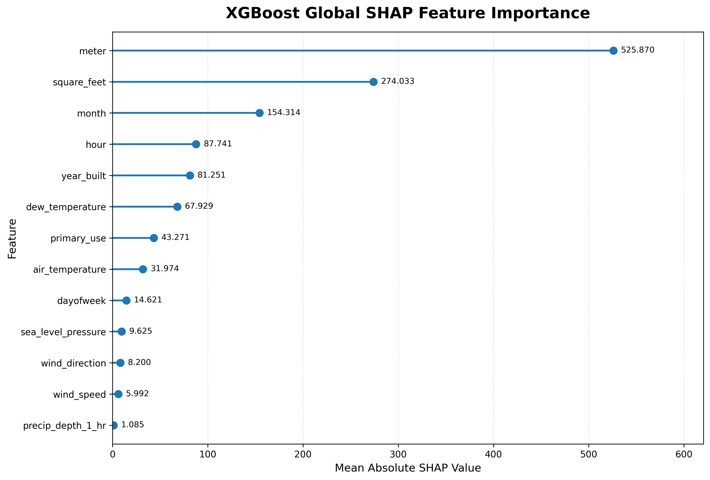
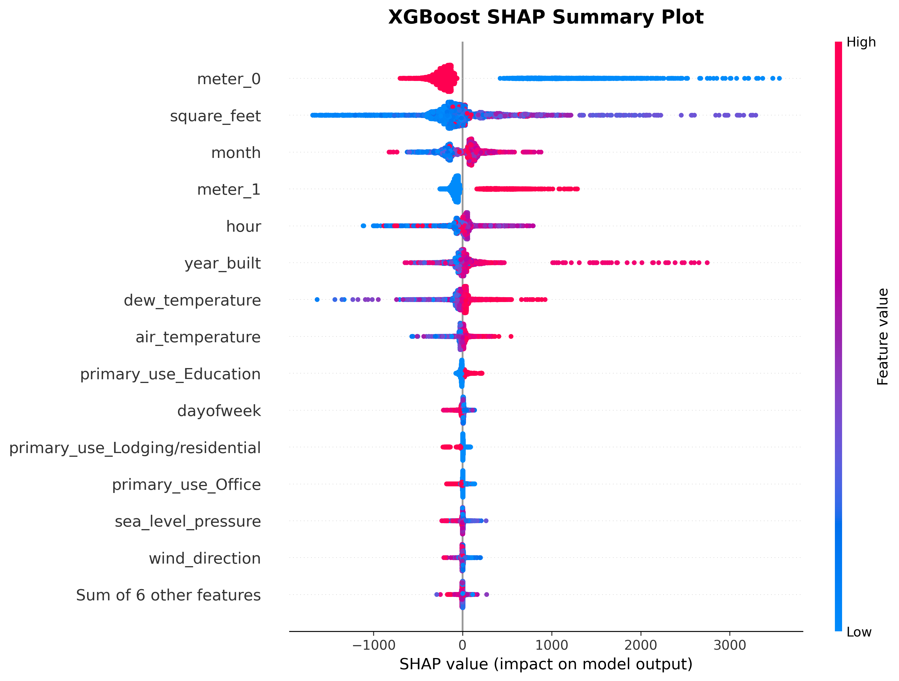
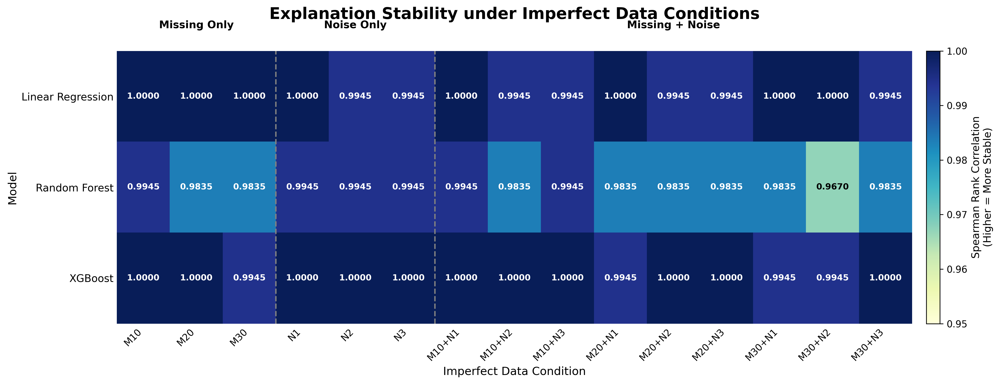
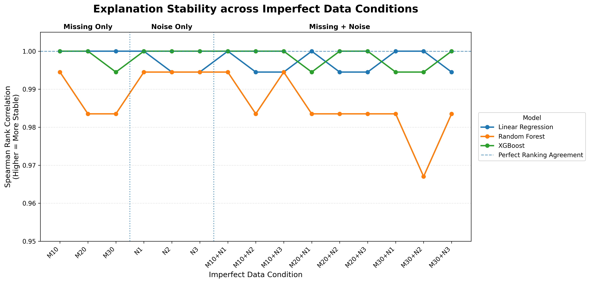

# 🏢 Smart Building Energy Prediction Lab

## Robust & Explainable Machine Learning under Imperfect Sensor Data

> **Can a machine learning model still make reliable and explainable energy predictions when sensor data becomes incomplete or noisy?**
> **当建筑传感器数据出现缺失和噪声时，机器学习模型还能保持可靠、稳定并且可解释吗？**

[](#)
[](#)
[](#)
[](#)
[](#)

## 🌐 Live Demo / 在线 Demo

👉 **[Click here to try the Smart Building Energy Prediction Lab](https://smart-building-energy-prediction.onrender.com)**

👉 **[点击这里进入智能建筑能源预测在线 Demo](https://smart-building-energy-prediction.onrender.com)**

> If the Render free instance has been inactive for a while, the first load may take a short time while the service wakes up.
> 如果 Render 免费实例长时间无人访问，第一次打开时可能需要稍等片刻等待服务启动。

---

# ✨ What is this project? / 这个项目是做什么的？

This project investigates **energy consumption prediction in smart buildings under imperfect sensor data**.

Instead of evaluating machine learning models only on clean data, this study introduces controlled **missing values and Gaussian noise** into the test data and evaluates not only prediction performance, but also **robustness, explainability, and explanation stability**.

本项目研究的是 **不完美传感器数据条件下的智能建筑能源消耗预测**。

与只在干净数据上比较模型预测效果的传统做法不同，本研究在测试数据中加入不同程度的 **缺失值和高斯噪声**，进一步分析模型的：

* 预测性能
* 鲁棒性
* 可解释性
* 解释稳定性

---

# 🎯 Core Research Question / 核心研究问题

> **A model may perform well when the data is clean — but what happens when the sensors are not?**

模型在干净数据上表现良好，并不代表部署后面对缺失、噪声或测量扰动时仍然可靠。

This project therefore asks:

> **Which machine learning model provides the best balance between predictive performance, robustness, and explainability under imperfect sensor data?**

因此，本项目重点回答：

> **在不完美传感器数据条件下，哪一种机器学习模型能够在预测性能、鲁棒性和可解释性之间取得更好的平衡？**

---

# 🔬 Experimental Design / 实验设计

The project compares three machine learning models with different levels of model complexity:

本研究选择了三个不同复杂度的机器学习模型：

| Model / 模型            | Role / 定位                                        |
| --------------------- | ------------------------------------------------ |
| **Linear Regression** | Simple and interpretable baseline / 简单且易解释的基线模型  |
| **Random Forest**     | Non-linear ensemble model / 非线性集成学习模型            |
| **XGBoost**           | Advanced boosting-based model / 更复杂的 Boosting 模型 |

All three models are trained using the **same clean training dataset**.

三个模型均使用 **相同的干净训练数据** 进行训练。

The trained models are then evaluated under **16 test conditions**:

随后，在 **16 种测试数据条件** 下评估模型：

```text
1 Clean Baseline
│
├── Missing Only
│   ├── 10%
│   ├── 20%
│   └── 30%
│
├── Gaussian Noise Only
│   ├── σ = 1
│   ├── σ = 2
│   └── σ = 3
│
└── Missing + Noise
    └── 3 × 3 = 9 combined conditions
```

### Total / 总计

**1 baseline + 15 imperfect conditions = 16 conditions**

---

# 📊 Dataset / 数据集

The project uses the **ASHRAE Great Energy Predictor III** dataset.

本项目使用 **ASHRAE Great Energy Predictor III** 数据集。

The prediction target is:

```text
meter_reading
```

The model uses **13 input features** from four groups:

模型使用 **13 个输入特征**，分为四类：

### 🏢 Building Features / 建筑特征

* `primary_use`
* `square_feet`
* `year_built`

### ⚡ Meter Feature / 能源表类型

* `meter`

### 🌤 Weather Features / 天气特征

* `air_temperature`
* `dew_temperature`
* `precip_depth_1_hr`
* `sea_level_pressure`
* `wind_direction`
* `wind_speed`

### 🕒 Time Features / 时间特征

* `hour`
* `dayofweek`
* `month`

The final clean test set contains:

**5,093 observations**

最终干净测试集包含：

**5,093 条测试样本**

---

# 🏆 Baseline Model Performance / 基线模型性能

| Model             |      RMSE ↓ |       MAE ↓ |       R² ↑ |
| ----------------- | ----------: | ----------: | ---------: |
| Linear Regression |     929.179 |     480.975 |     0.4877 |
| Random Forest     |     316.023 | **105.833** |     0.9407 |
| **XGBoost**       | **299.166** |     109.316 | **0.9469** |

## Key Findings / 主要发现

* 🥇 **XGBoost achieved the lowest RMSE**
* 🥇 **XGBoost achieved the highest R²**
* 🥇 **Random Forest achieved the lowest MAE**
* Linear Regression performed substantially worse than the two nonlinear models.

中文总结：

* 🥇 **XGBoost 的 RMSE 最低**
* 🥇 **XGBoost 的 R² 最高**
* 🥇 **Random Forest 的 MAE 最低**
* Linear Regression 的整体预测性能明显弱于两个非线性模型

> **Important: Model complexity does not guarantee superiority across every evaluation metric.**
> **重要：模型越复杂，并不意味着在所有评价指标上都一定更好。**

<p align="center">
  
</p>

---

# 🛡️ Robustness Analysis / 鲁棒性分析

Robustness is evaluated by measuring how much RMSE increases when sensor data quality decreases.

鲁棒性通过观察传感器数据质量下降后 **RMSE 增加多少** 来衡量。

### Metrics / 指标

```text
RMSE Degradation
RMSE Degradation (%)
```

Lower degradation indicates stronger relative robustness.

RMSE 增幅越小，说明模型在数据受到破坏时越稳定。

The experiments include:

* Missing values
* Gaussian noise
* Combined missing values + Gaussian noise

实验包括：

* 缺失值
* 高斯噪声
* 缺失值 + 高斯噪声组合条件

<p align="center">
  
</p>

## One Interesting Observation / 一个值得注意的结果

Linear Regression shows relatively small percentage degradation under imperfect data, but its **absolute prediction error is already much higher**.

Linear Regression 在不完美数据条件下的相对退化比例较小，但它本身的 **绝对预测误差明显更高**。

Therefore:

> **Low relative degradation does not automatically mean good overall prediction performance.**

因此：

> **相对退化幅度小，并不等于模型整体预测效果最好。**

---

# 🧠 Explainable Machine Learning / 可解释机器学习

Explainability is evaluated at **two levels**.

本研究从 **两个层面** 对模型可解释性进行分析。

---

## 1️⃣ Baseline Explainability / 基线可解释性

Different model-specific explanation methods are used:

不同模型采用与其结构相适应的解释方法：

| Model             | Explainability Method |
| ----------------- | --------------------- |
| Linear Regression | Coefficients          |
| Random Forest     | Feature Importance    |
| XGBoost           | SHAP                  |

### Linear Regression

<p align="center">
  
</p>

### Random Forest

<p align="center">
  
</p>

### XGBoost SHAP

<p align="center">
  
</p>

<p align="center">
  
</p>

---

# 🔄 Explanation Stability / 解释稳定性

A model may be explainable under clean data, but an important question remains:

> **Does it continue relying on similar features when sensor data becomes imperfect?**

模型在干净数据下可以被解释，但另一个关键问题是：

> **当数据质量下降以后，它是否仍然依赖相似的特征进行预测？**

To evaluate this, SHAP-based feature contributions are calculated for all three models.

为了进行统一比较，本研究对三个模型都使用基于 SHAP 的特征贡献分析。

Feature rankings under the 15 imperfect conditions are compared with the clean baseline ranking using:

### Spearman Rank Correlation

```text
ρ closer to 1
      ↓
More similar feature ranking
      ↓
Higher explanation stability
```

即：

```text
ρ 越接近 1
      ↓
特征排序越接近基线
      ↓
解释稳定性越高
```

---

# 📌 SHAP Sample Stability Check / SHAP 样本稳定性检查

To balance explanation stability and computational cost, the final explanation stability analysis uses a fixed sample of:

**300 test observations**

为了在解释稳定性和计算成本之间取得平衡，最终解释稳定性分析使用固定的：

**300 条测试样本**

The sample size was checked using:

```text
200 samples
300 samples
500 samples
```

The 300-sample ranking was highly consistent with the 500-sample reference.

300 条样本得到的特征排序与 500 条样本参考结果保持高度一致。

| Model             | 300 vs 500 Spearman |
| ----------------- | ------------------: |
| Linear Regression |              1.0000 |
| Random Forest     |              0.9945 |
| XGBoost           |              1.0000 |

---

# 📈 Explanation Stability Results / 解释稳定性结果

| Model             | Mean Stability ↑ | Minimum Stability ↑ |
| ----------------- | ---------------: | ------------------: |
| Linear Regression |           0.9974 |              0.9945 |
| Random Forest     |           0.9868 |              0.9670 |
| **XGBoost**       |       **0.9985** |          **0.9945** |

## Interpretation / 结果解释

All three models maintained high feature-ranking stability.

三个模型在实验条件下均保持了较高的特征排序稳定性。

However:

* **XGBoost achieved the highest mean explanation stability**
* Linear Regression was also highly stable
* Random Forest showed greater variation under several imperfect conditions

但是：

* **XGBoost 的平均解释稳定性最高**
* Linear Regression 同样保持了很高的稳定性
* Random Forest 在部分不完美数据条件下表现出更明显的排名变化

> Explanation stability measures **consistency**, not causal correctness.

> 解释稳定性衡量的是 **解释结果是否一致**，并不意味着这些解释具有因果意义。

<p align="center">
  
</p>

<p align="center">
  
</p>

---

# 🌐 Interactive Web Demo / 在线交互 Demo

The project includes a complete Streamlit web application.

本项目提供一个完整的 Streamlit 在线交互系统。

## 🚀 Try the Demo / 立即体验 Demo

👉 **[Open the Live Demo](https://smart-building-energy-prediction.onrender.com)**

👉 **[点击这里打开在线 Demo](https://smart-building-energy-prediction.onrender.com)**

The demo contains five modules:

Demo 包含五个核心模块：

### 🏠 Overview

Research design and project overview
研究框架与项目概览

### 🔮 Prediction Lab

Run real predictions using the three trained models
使用三个最终模型进行真实预测

Two modes are available:

* **Test Sample** — select an existing test observation and compare actual vs predicted values
* **Manual Input** — manually enter 13 features and generate predictions

提供两种预测方式：

* **Test Sample**：选择真实测试样本，比较真实值与三个模型预测值
* **Manual Input**：手动输入 13 个特征，让三个模型现场预测

### 📊 Model Performance

Compare RMSE, MAE, and R²
比较三个模型的 RMSE、MAE 和 R²

### 🛡 Robustness Analysis

Explore model degradation under imperfect sensor conditions
查看不同缺失值与噪声条件下的模型鲁棒性

### 🧠 Explainability

Explore coefficients, feature importance, SHAP, and explanation stability
查看系数、特征重要性、SHAP 以及解释稳定性

---

# 🏗️ Project Structure / 项目结构

```text
smart-building-energy-prediction/
│
├── app.py
├── requirements.txt
├── render.yaml
├── .python-version
│
├── models/
│   ├── linear_regression_pipeline.joblib
│   ├── random_forest_pipeline.joblib
│   └── xgboost_pipeline.joblib
│
├── data/
│   ├── test_split.csv
│   ├── baseline_model_comparison.csv
│   ├── all_models_16_conditions_results.csv
│   ├── model_robustness_summary.csv
│   ├── linear_regression_coefficients.csv
│   ├── random_forest_feature_importance.csv
│   ├── xgboost_shap_importance.csv
│   ├── explanation_stability_results_display.csv
│   └── explanation_stability_summary.csv
│
└── assets/
    ├── baseline_grouped_metrics_comparison.png
    ├── model_performance_and_robustness_comparison.png
    ├── linear_regression_top_coefficients.png
    ├── random_forest_feature_importance.png
    ├── xgboost_global_shap_importance.png
    ├── xgboost_shap_summary_plot.png
    ├── explanation_stability_heatmap.png
    └── explanation_stability_trend.png
```

---

# 🧰 Tech Stack / 技术栈

* Python 3.12
* pandas
* NumPy
* scikit-learn
* XGBoost
* SHAP
* Streamlit
* Joblib
* GitHub
* Render

---

# 💻 Run Locally / 本地运行

Clone the repository:

```bash
git clone https://github.com/hee289427-wq/smart-building-energy-prediction.git
cd smart-building-energy-prediction
```

Install dependencies:

```bash
pip install -r requirements.txt
```

Run the application:

```bash
streamlit run app.py
```

Then open:

```text
http://localhost:8501
```

---

# 💡 Why This Project Matters / 项目价值

Most machine learning studies focus mainly on:

> **“How accurate is the model?”**

This project additionally asks:

> **“Does it remain reliable when the sensor data becomes imperfect?”**

and:

> **“Does the model continue relying on similar information when data quality decreases?”**

很多机器学习项目主要回答：

> **“这个模型准不准？”**

而本研究进一步关注：

> **“当传感器数据出现缺失和噪声以后，它还可靠吗？”**

以及：

> **“当数据质量下降以后，模型的解释是否仍然稳定？”**

This allows predictive performance, robustness, and explainability to be evaluated within one experimental framework.

这使得预测性能、鲁棒性和可解释性能够在同一个实验框架下被统一评估。

---

# 🎓 Research Context / 研究背景

This project was developed as part of a **Master of Artificial Intelligence research project at Universiti Malaya**.

Research topic:

> **Robust and Explainable Machine Learning for Energy Consumption Prediction in Smart Buildings under Imperfect Sensor Data**

本项目为 **马来亚大学人工智能硕士研究项目** 的一部分。

研究主题：

> **不完美传感器数据条件下智能建筑能源消耗预测的鲁棒与可解释机器学习研究**

---

# 👤 Author / 作者

**HE CHENZHEN (Eric)**
Master of Artificial Intelligence
Universiti Malaya

---

# ⭐ If You Find This Project Interesting / 如果你觉得这个项目有意思

Feel free to:

* ⭐ Star the repository
* 🍴 Fork the project
* 🔬 Explore the experiments
* 🌐 Try the live demo
* 💬 Share suggestions or research ideas

欢迎：

* ⭐ Star 项目
* 🍴 Fork 仓库
* 🔬 查看实验设计
* 🌐 在线体验 Demo
* 💬 提出建议或交流研究思路

---

## 🚀 Live Demo / 在线体验

👉 **[Try the Smart Building Energy Prediction Lab](https://smart-building-energy-prediction.onrender.com)**

👉 **[立即体验智能建筑能源预测 Demo](https://smart-building-energy-prediction.onrender.com)**

> **Clean data tells us how accurate a model can be.
> Imperfect data tells us how reliable it really is.**

> **干净数据告诉我们模型能有多准，
> 不完美数据才能真正告诉我们它有多可靠。**
